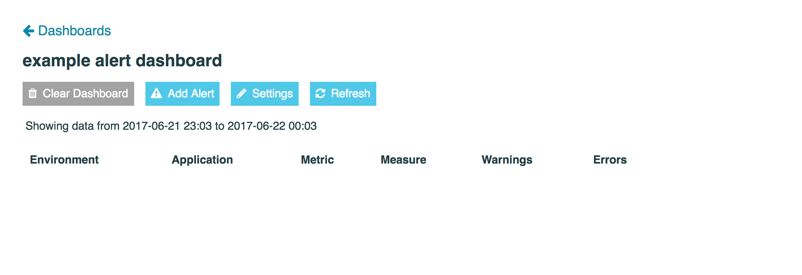
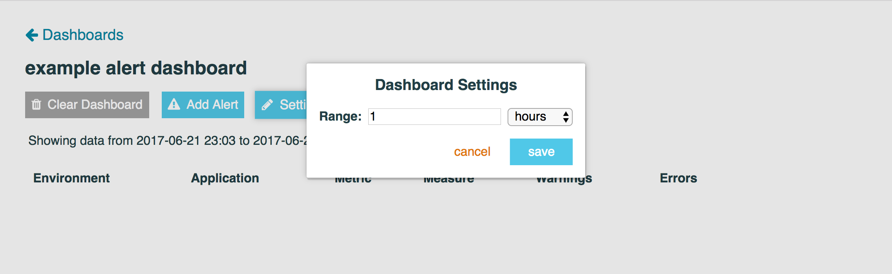
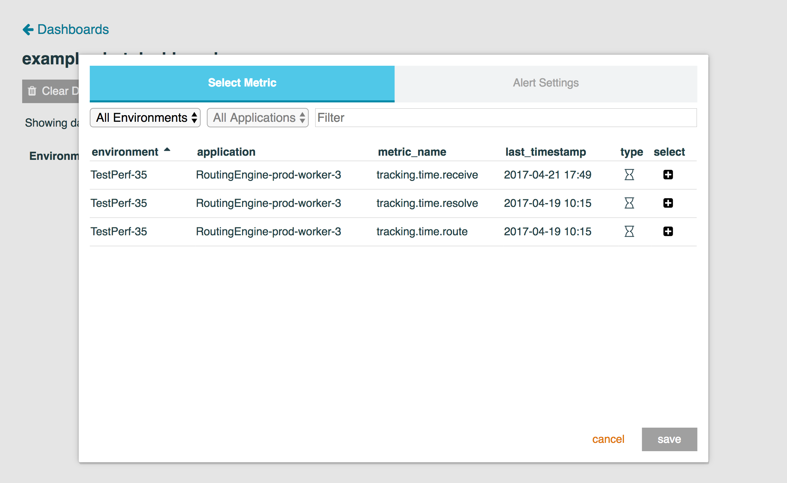
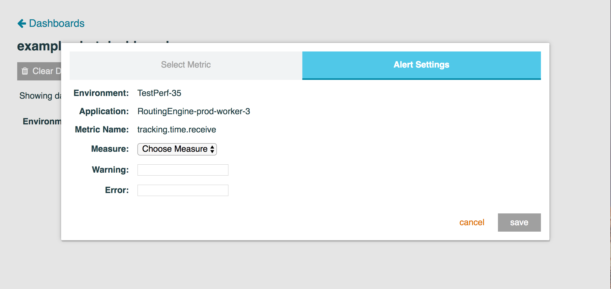
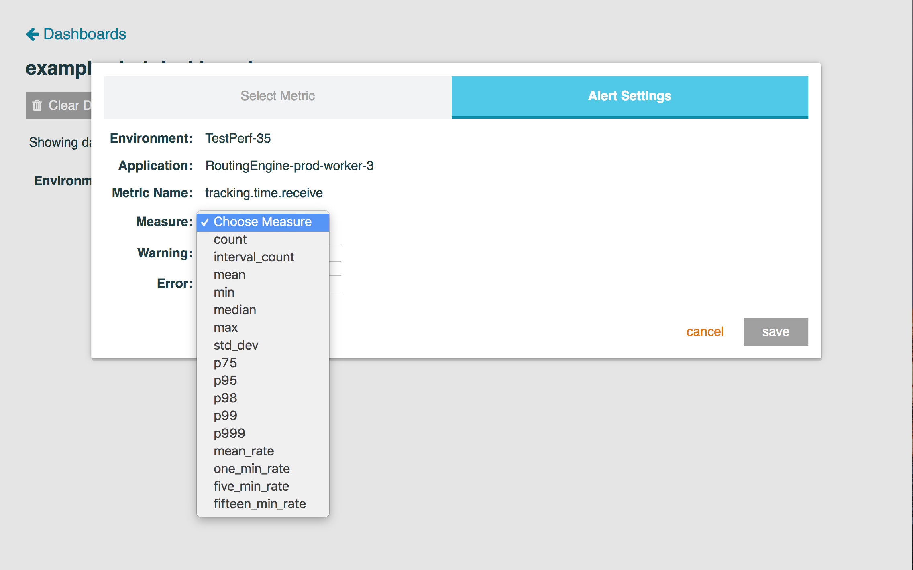
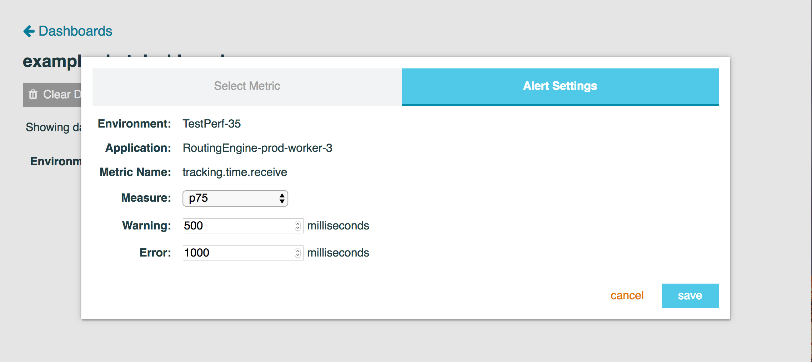
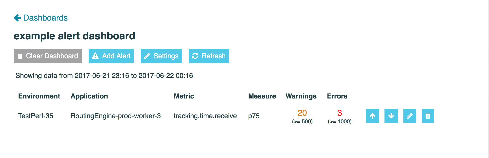

# Alert Dashboards

Alert Dashboards are simple, they allow you to pick a specific metric and measure, set a warning and error threshold,
and monitor how many warnings and errors have happened in the last time period you are interested in.

An empty Alert Dashboard looks like this:

The first thing you will want to do with a new dashboard is set the time range to search for errors and warnings. New
Alert Dashboards default to the last hour, but can be changed by clicking the "Settings" button at the top of the page:

You can choose your multiplier and your period, available periods are `minutes`, `hours`, and `days`.

The next thing you'll want to do is add an alert, to do so simply click "Add Alert", and you will be prompted to select
a metric just like Time Series Dashboards:

After you pick a metric you will be prompted to edit a few more settings:

Simply pick a measure like you would with a Time Series Dashboard:

Next set your warning and error thresholds (warning threshold must be smaller than the alert threshold):

Next click save and you will see your alert with the amount of errors and warnings in the time period you specified
earlier:

As you can see the warning and error thresholds are rendered below the count in parentheses. The above image has no
alerts or warnings in the last hour, but if it did it would look like this:

When an alert has any warnings the number is marked in orange, if there are any errors the number is marked in red. If
there are either 0 warnings or 0 errors their numbers appear in green.
