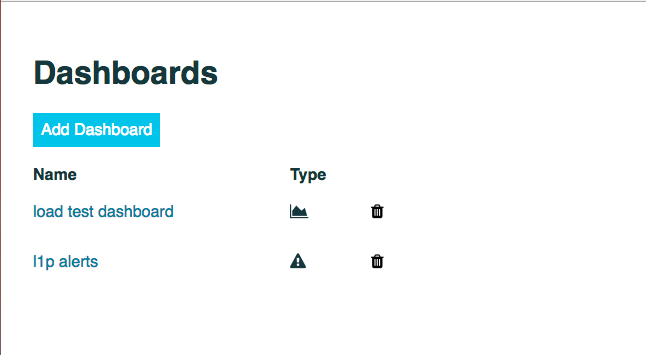
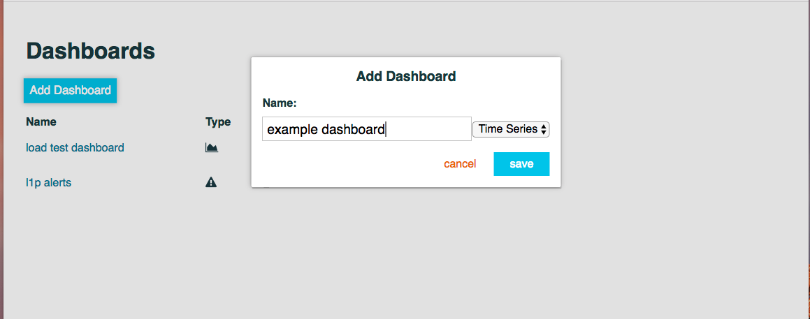
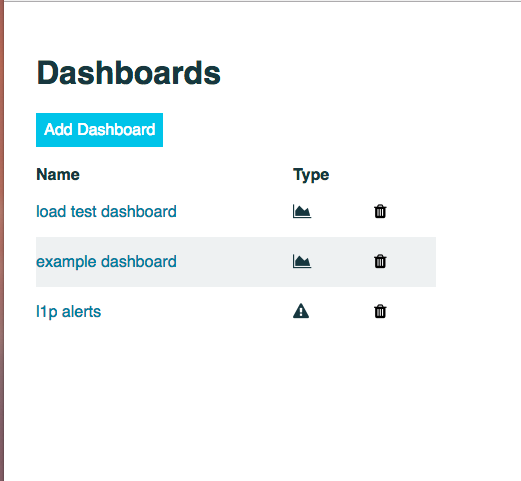

The metrics platform allows users to create as many dashboards as they like, and share them via their unique URLs. The
default page for the metrics platform is the dashboards page, which lists all of the current dashboards and their types:

To create a new dashboard simply click the "Add Dashboard" button, give it a name, choose the type, and hit save:

Once you have saved the dashboard you will see the new dashboard in the dashboard list, click it to start editing your
dashboard.

Currently two dashboard types are available: Time Series and Alerts, documentation for each is below:

* [Time Series](time-series.md)
* [Alerts](alerts.md)
