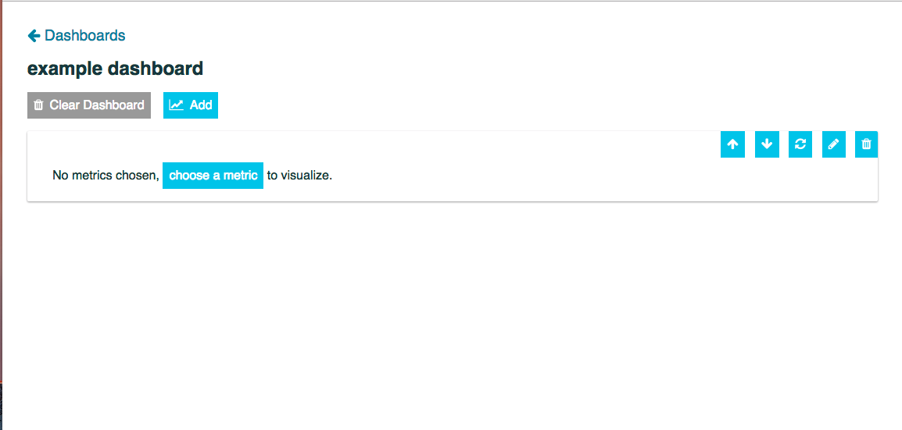
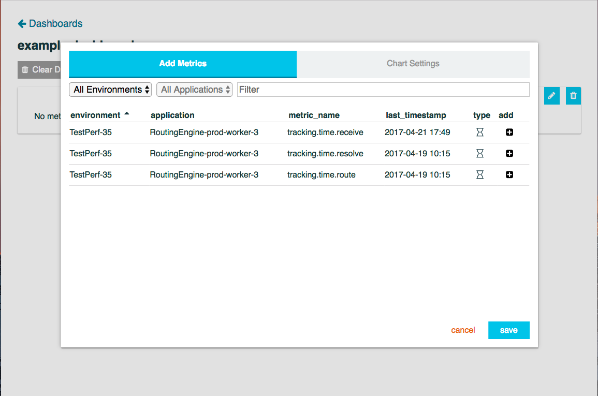
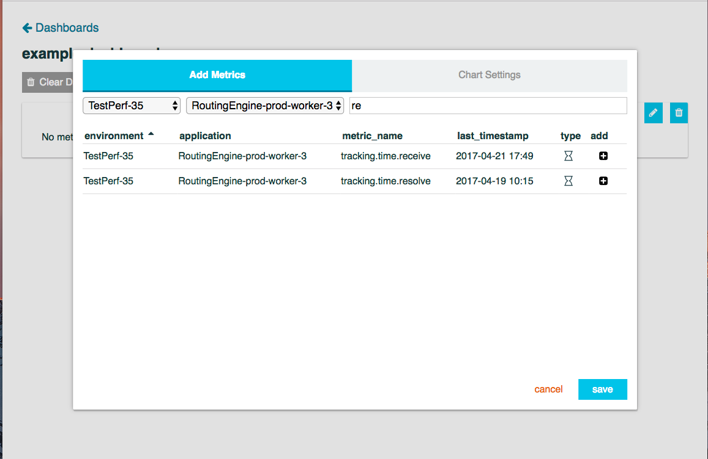
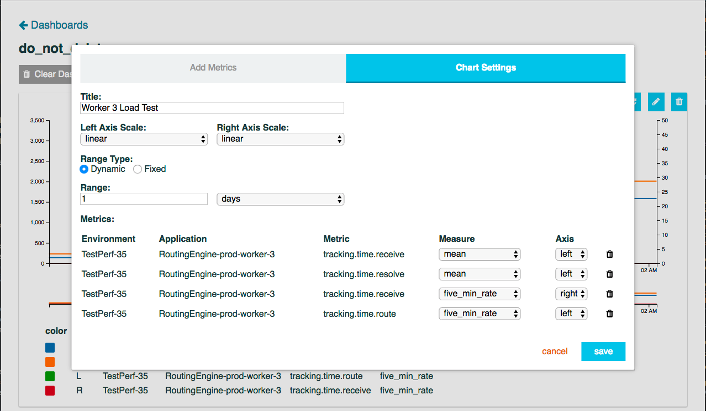
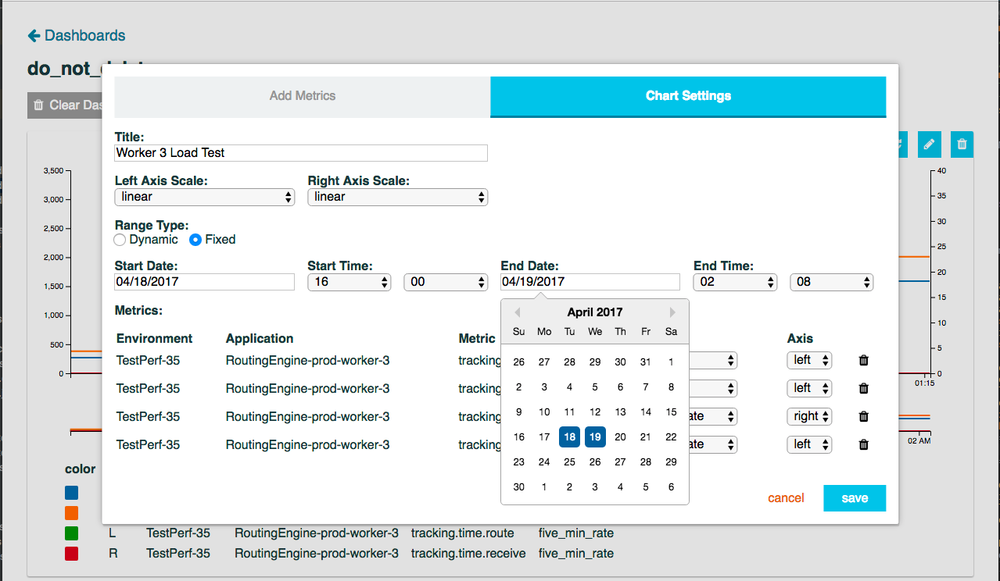
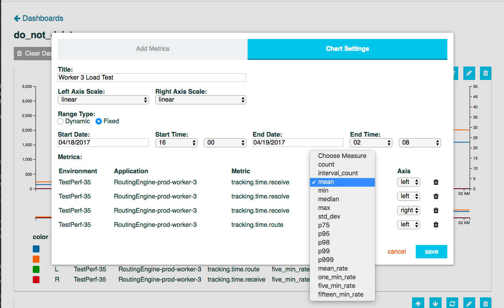
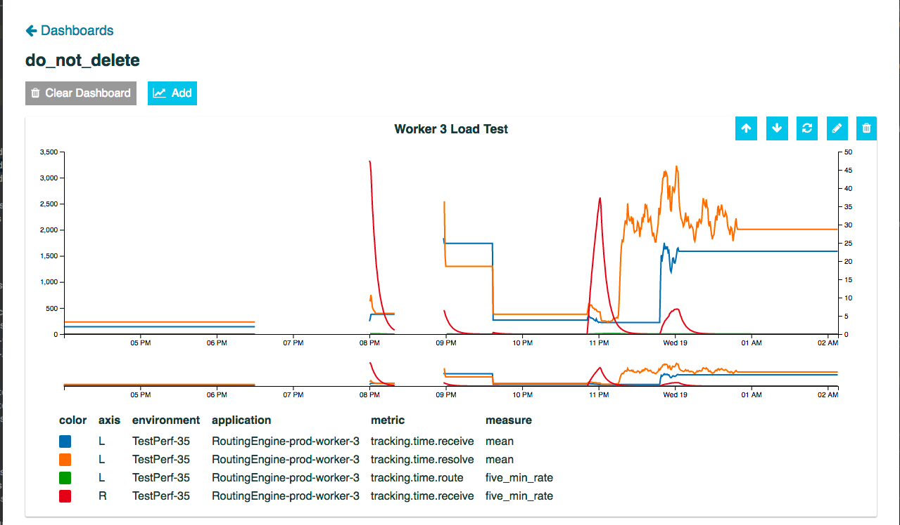
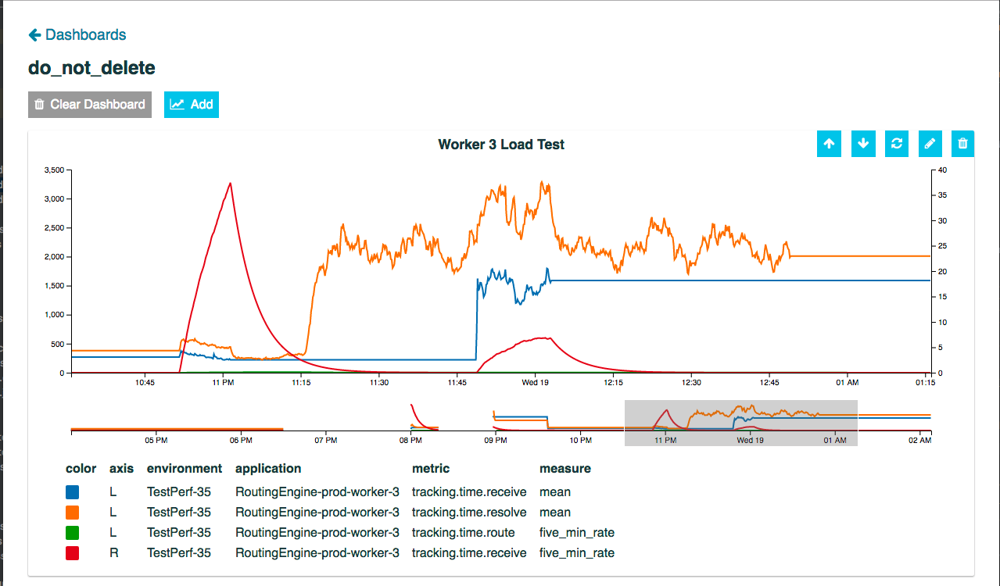

# Time Series Dashboards

On first page load a new chart is added by default, but is not configured. The chart will prompt you to choose a metric
to visualize.

After you click the "choose a metric" button you will be presented with the metric selector:

You can filter the metrics by environment, application, and with fuzzy search. You can also click on the columns to
change how metrics are sorted.

After you pick a metric you will be taken to the Chart Settings Tab:

The Chart Settings tab lets you add a chart title, change the scale of the left or right axes, choose the date range,
and pick a specific measure to plot for your selected metrics.

Dynamic ranges allows you to view Metric data from now back to some period of time that you choose. You may enter a
range multiplier in the text box and a range frequency from the drop down. Dynamic ranges let you pick minutes, hours,
and days for frequency. For example to view the last weeks worth of data enter 7 into the input box and pick "days" from
the dropdown. When using a dynamic range the refresh button will re-query for the most recent data in the dynamic range
you specified.

Fixed time ranges let you choose a Start Date, Start Time, End Date, and End Time to query for:

The last thing you will need to configure is the measure you want to plot. Each metric has multiple measures that can be
visualized. Counters are simple and have two measures: `count` and `interval_count`, Timers are more complex and have
many useful measures: `count`, `interval_count`, `mean`, `min`, `median`, `max`, `std_dev`, `p75`, `p95`, `p98`, `p99`,
`p999`, `mean_rate`, `one_min_rate`, `five_min_rate`, and `fifteen_min_rate`.

After you have chosen your desired metrics and settings click "save" to load data and see your desired chart:

You will see two views of the same data, the smaller view below the main area can be "brushed", which then re-renders
data between the specific time range you have brushed. If available we re-query for more data between the brushed area:

